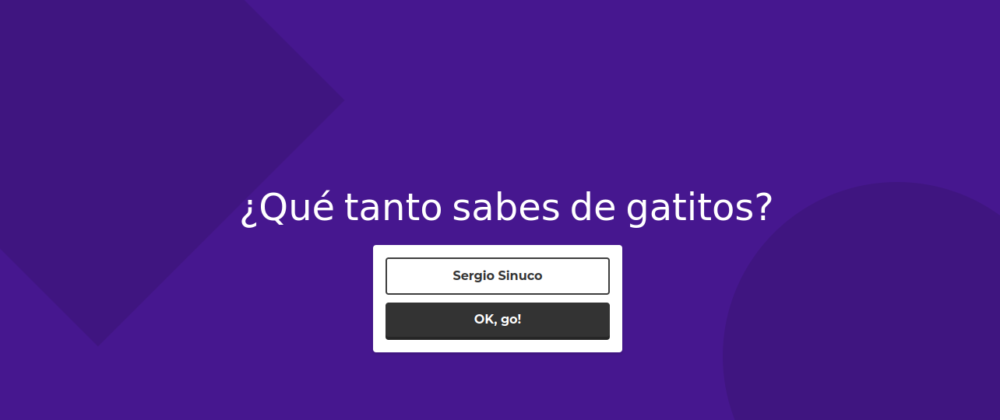
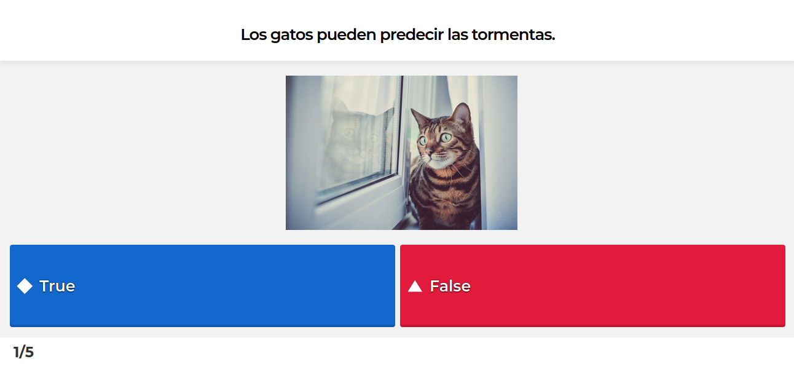
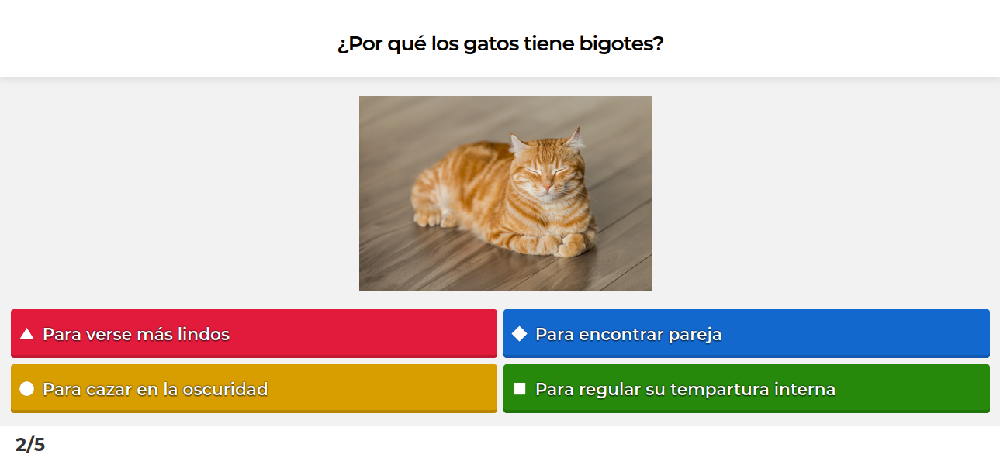
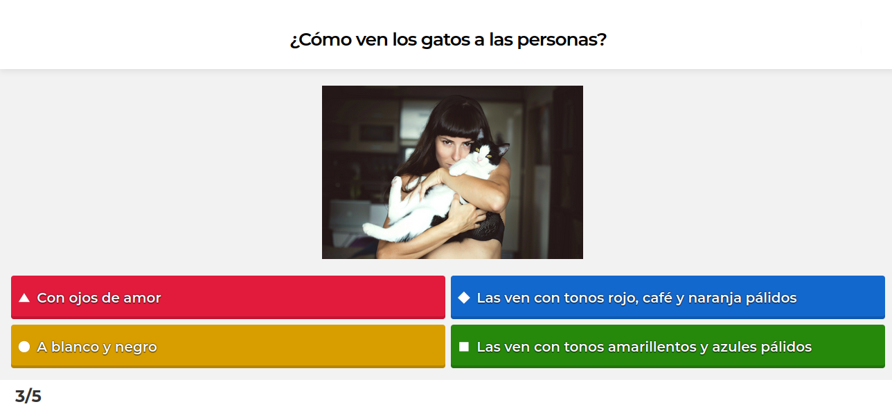
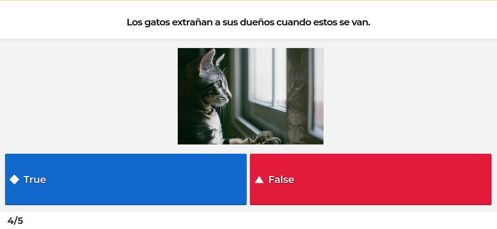
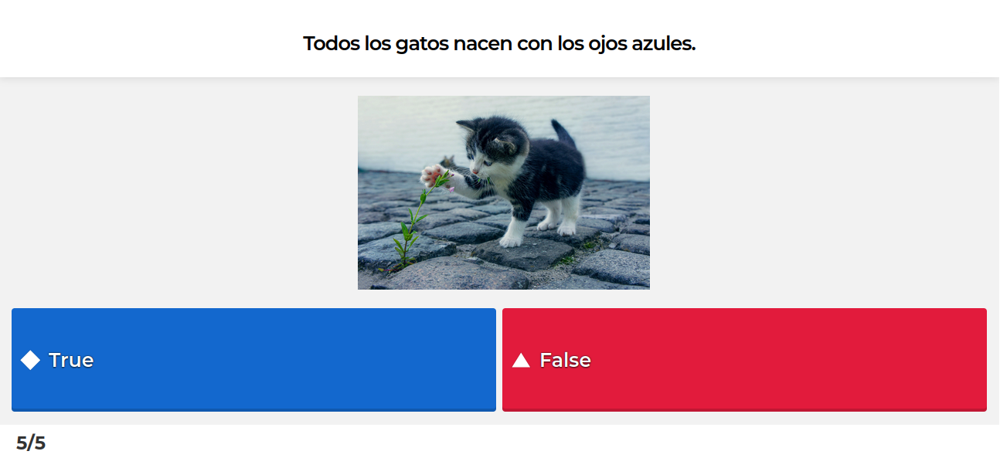
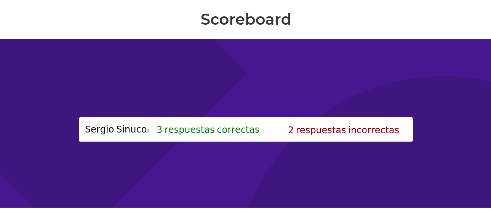

# Reto práctica HTML, CSS y JavaScript

## Resumen del reto

Te invitamos a desarrollar una página web donde el usuario pueda resolver un examen o quiz. 

En este examen, el usuario recibirá una serie de preguntas. Cada pregunta podrá tener dos o más opciones de respuesta para elegir, pero sólo una opción será la correcta. La siguiente pregunta aparecerá automáticamente al seleccionar una opción.

Al finalizar las preguntas se deberá mostrar al usuario el número de preguntas respondidas correcta e incorrectamente.

Puedes elegir libremente el tema de las preguntas, por ejemplo puedes preguntar acerca de gatitos o acerca de la vida de Britney Spears.

## Checklist de aceptación del reto

* [ ] El examen tiene 5 preguntas como mínimo.
* [ ] Cada pregunta tiene al menos 2 opciones de respuesta y entre estas sólo una es la correcta.
* [ ] Antes de iniciar el examen se solicita el nombre al usuario.
* [ ] Al seleccionar una opción de respuesta automáticamente se carga la siguiente pregunta.
* [ ] Al responder la última pregunta, se muestra al usuario el número de preguntas respondidas correctamente e incorrectamente.
* [ ] El número de respuestas correctas e incorrectas se calcula correctamente.

## Conceptos técnicos a practicar

Esperamos que con este reto puedas practicar los siguientes conceptos:

### HTML y CSS

* Maquetación en HTML
* Aplicación de CSS

### JavaScript

* [Declaración de variables](https://developer.mozilla.org/es/docs/Web/JavaScript/Guide/Grammar_and_Types)
* [Condicionales (if-else)](https://developer.mozilla.org/es/docs/Web/JavaScript/Guide/Control_flow_and_error_handling)
* [Funciones](https://developer.mozilla.org/es/docs/Web/JavaScript/Guide/Functions)
* [Bucles (for)](https://developer.mozilla.org/es/docs/Web/JavaScript/Guide/Loops_and_iteration)
* Selectores del DOM.
* Manejo de eventos del DOM.
* [Manipulación del DOM.](https://developer.mozilla.org/es/docs/Referencia_DOM_de_Gecko/Introducci%C3%B3n)
(appendChild |createElement | createTextNode| innerHTML | textContent | etc.)

## Funcionalidades opcionales

Si cumpliste las funcionales anteriores y quieres practicar aún más te sugerimos implementar las siguientes funcionalidades:

* Agrega a la interfaz dos botones que le permitan al usuario navegar a través de las preguntas del examen. El primer botón llevará al usuario a la pregunta anterior mientras que el segundo botón lo llevará a la siguiente pregunta. En el caso en que un usuario regrese a una pregunta que ya había respondido, se debe automáticamente marcar la opción de respuesta seleccionada anteriormente.
* Al presentar los resultados del examen, para las preguntas incorrectas muestra la opcion de respuesta corecta y la opcion de respuesta marcada por el usuario.

## Ejemplo

A continuación te presentamos una implementación de ejemplo de este reto.

En primer lugar hay una vista de bienvenida mostrando el tema del examen y pidiendo el nombre al usuario.

Luego se muestra la primera pregunta. En esta implementacián hay un texto para la pregunta, una imagen que la acompaña y dos opciones de respuesta. Al elegir una opción automáticamente se carga la segunda pregunta.

En la segunda pregunta de nuevo hay un texto para la pregunta, una imagen que la acompaña pero esta vez hay cuatro opciones de respuesta. Cada vez que el usuario elige una opción se carga automáticamente la siguiente pregunta. En la parte inferior izquierda de la pantalla se indica al usuario en que pregunta se encuentra y cuantas preguntas son en total.

Finalmente se muestra el nombre del usuario y el número de preguntas correctas e incorrectas.

